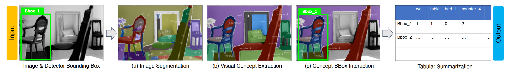
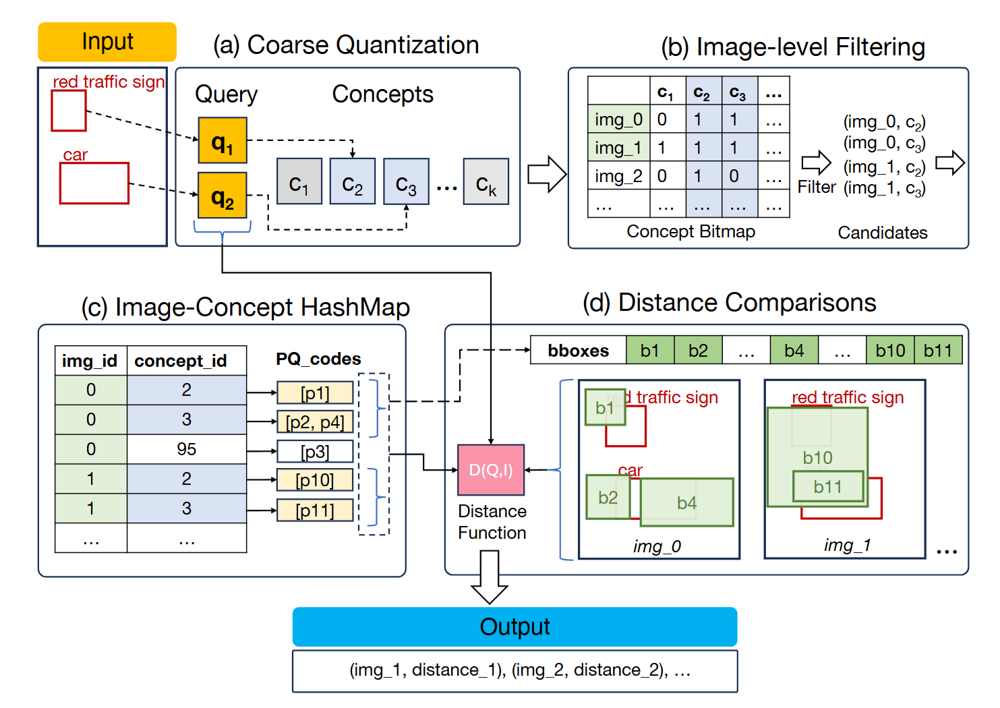

# Seeing in Concepts: Enabling Structured Image Representation and Analysis with Visual Concepts

This repository contains code for our paper, where we describe a new method for conducting image analysis with visual concepts.
Visual concepts can be extracted automatically with minimal human supervision leveraging current vision foundation models. 

This repository contains code for (1) VCR, a slice discovery framework for object detection models with novel pruning optimizations.

<figure>

<!-- <figcaption>A depiction of the VCR pipeline with image segmentation, concept formation, and data slicing</figcaption> -->
</figure>
*A depiction of the VCR pipeline with image segmentation, concept formation, and data slicing*

And (2) ICQ, an index for spatial-semantic image search that enables efficient compression and search via concept-aware quantization and filtering. 
<figure>

<!-- <figcaption>A depiction of ICQ's quantization and filtering for spatial-semantic image search</figcaption> -->
</figure>
*A depiction of ICQ's quantization and filtering for spatial-semantic image search*

## VCR
The VCR folder contains code for:
* The VCR Interface itself for visualizing and mining results
* Code for creating custom detection results and running the VCR pipeline
* Evaluation code including details on how to replicate our results as well as the datasets used

## ICQ
The ICQ folder contains code for:
* The ICQ index for spatial-semantic image search
* Example code on utilizing ICQ for image retrieval
* Code for evaluating ICQ's retrieval performance

