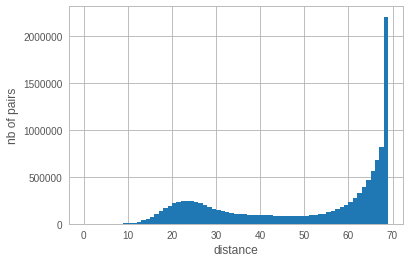
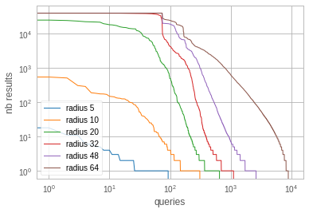
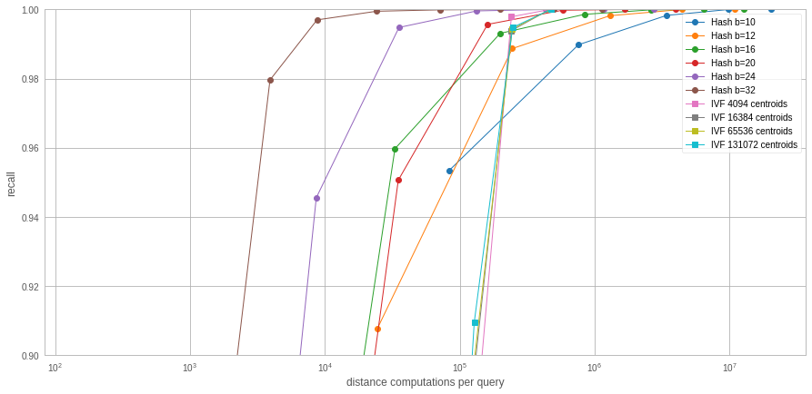
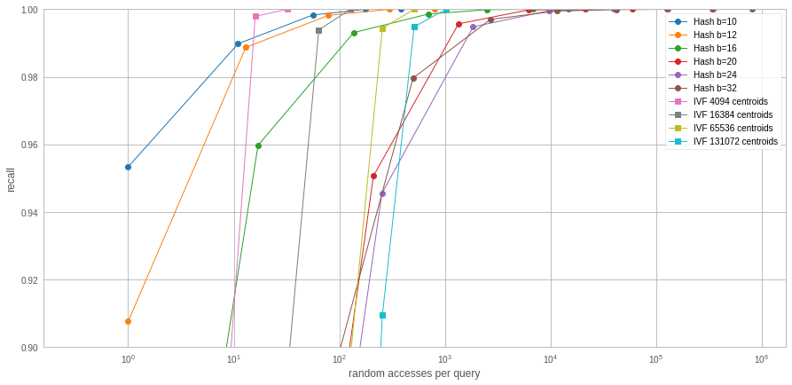
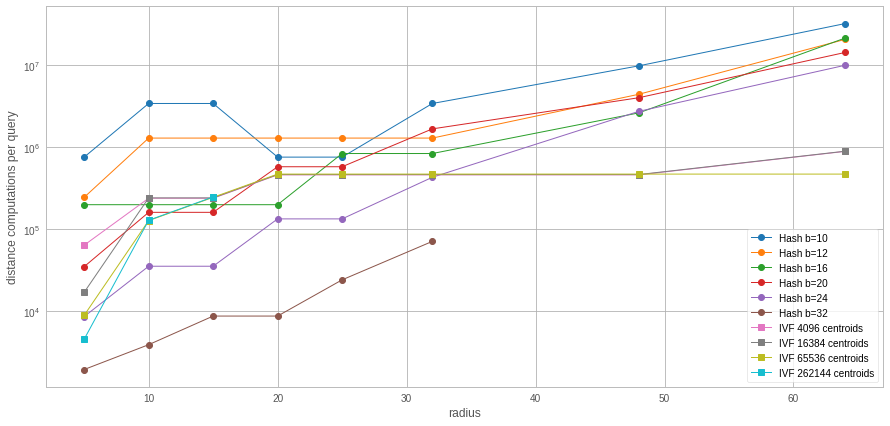
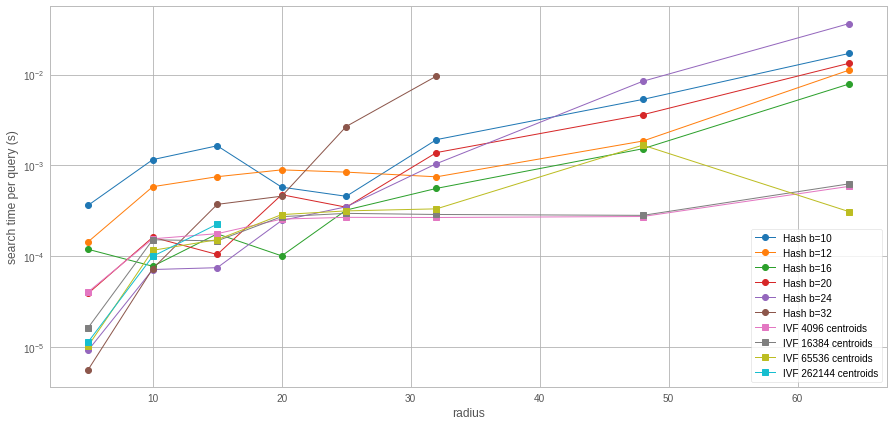
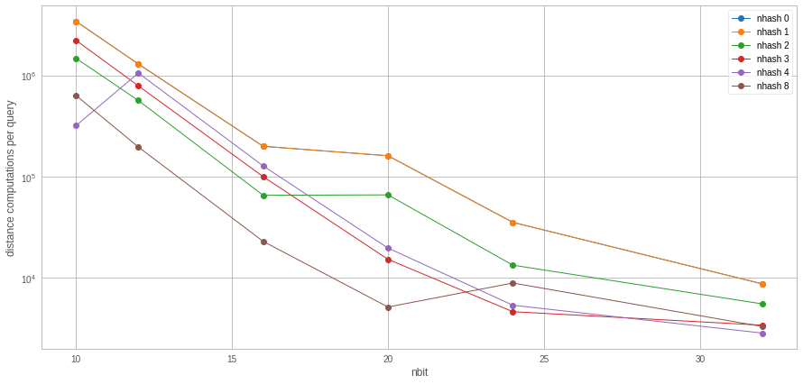

This study compare 3 non-exhaustive Faiss indexes: 

* `IndexBinaryIVF`: splits the space using a set of centroids obtained by k-means. At search time `nprobe` clusters are visited.

* `IndexBinaryHash`: uses the first b bits of the binary vectors as an index in a hash table where the vectors are stored. At search time, all the hash buckets at a Hamming distance < `nflip` are visited

* `IndexBinaryMultiHash`: `nhash` such hash tables are constructed. At search time, the union of the hash results from each of the tables is considered. This is the method of “Fast Search in Hamming Space with Multi-Index Hashing”, Norouzi et al, CVPR’12, 

The ground truth is given by the `IndexBinaryFlat` index.
In all cases what matters is range search (finding all vectors within some Hamming distance radius).

# Experimental setup

## Test setup

The input vectors are 50M+10k 256-bit binary hash vectors.
The vectors are obtained from a CNN applied on images and binarized. 
The 50M first vectors serve as the database, the 10k ones are the queries. Both are sampled randomly.

## Accuracy and efficiency measures

Since each index returns exact distances between query and database vectors, only the recall matters. So the accuracy measure is range search recall. 

At search time, the efficiency can be measured as: 

- Wall clock time with multithreaded searches. +: it is concrete. -: depends on many parameters. In this case the index is searched in RAM.

- Number of distance computations: +: good proxy for amount of memory scanned (which is the limiting factor)

- Number of random accesses: +: for all the indexes, the memory accesses are sequential read after a random access. This is important when the data is stored in a database that must be queried, while the sequential scan is on a small sequence. 

## Stats on matches and distances

There are many small distances:

This is due to the distribution of image descriptors. For random uniform 256-bit descriptors, it is almost impossible to have distances as low as 15 or 20 (binomial distribution).

The number of results per query (sorted by decreasing nb of results per query, on a 5M sample) looks like:

This is a Zipf-like distribution, with a few particularities: 

* There is a cap on the max neighbors that spans the radiuses. This may be due to some viral content. This probably explains the bump in the previous plot

* For lower radiuses there are many queries that don't have a single result 

# Results

We start with a few experiments of `IndexBinaryHash` vs. `IndexBinaryIVF`.

## Hash vs. IVF for fixed radius

The results below are for a radius of 15. The different operating points are obtained by adjusting search-time parameters: 

- for `IndexBinaryIVF` this is `nprobe`: number of clusters to explore at search time, set to be a power of 2.

- for `IndexBinaryHash` this is `nflip`: Hamming radius around query hash to explore.

The results are quite obviously in favor of the Hash index in terms of distance computations. When measuring the number of random accesses: 

It seems that IVF has a few interesting operating points, but these are for 4096 centroids, where the inverted lists are too long to be practical.

## Dependency on the radius

To measure the performance as a function of the radius, we fix the target recall at 99% and pick the "cheapest" (lowest nprobe/nhash) operating point that obtains this recall for each radius.

Observations: 

- in this case, the number of operating points that can be attained is discrete because it depends on the number of bit flips that we allow in the IndexBinaryHash or the nprobe for IndexBinaryIVF, that we set to powers of 2

- For low radiuses, the IndexBinaryHash is better in terms of number of distance computations

- For higher radiues (>32) the IndexBinaryIVF is better. Note that the b=32 plot stops at that point because the number of required bit flips to reach 99% recall is too high (ie. search becomes prohibitively slow).

- The size of the hash table in the case of b=32 is 39M, which means that most buckets contain a single value. There again random accesses may be a better measure.

The same plot in terms of search time:

Here again the breaking down point between IVF and Hashing is around a radius 30.

## Impact of shuffling 

Until now we used the first few bits of the binary hash as key into the hash table. What is the impact of the order of the bits? To evaluate this, we shuffle the bits randomly a few times to test other orders. 
The setting is b=24, radius=15.

So it seems that the order of bits **is** important. A bad shuffling incurs a 3x cost impact (for the recall=0.95 operating point).
Shuffling has no impact on IVF, that uses a k-means clustering.

## Multi-index hashing vs. single-index hashing

We set the radius at 15 and compare a single hash vs. multiple hash tables. 
In this case, we also look at the first operating point where we get > 0.99 recall, depending on the number of hash tables and the number of bits.

Observations: 

- nhash 0 = sanity check with `IndexBinaryHash`: it should be the same as `IndexBinaryMultiHash` with nh=1 (this is the case here)

- Increasing the number of hashtables decreases the number of distances to compute by a bit

So there is some gain to use several hash tables. However, increasing the number of hashtables increases the number of random accesses proportionally (not plotted) and in addition each distance computation requires a random access. Therefore, in this case, MultiHash may not be an attractive solution.

## Conclusions

For small radiuses, binary hashing is very competitive with IVF. 
Multi-index hashing is an interesting option, but requires a lot of additional memory and random accesses.