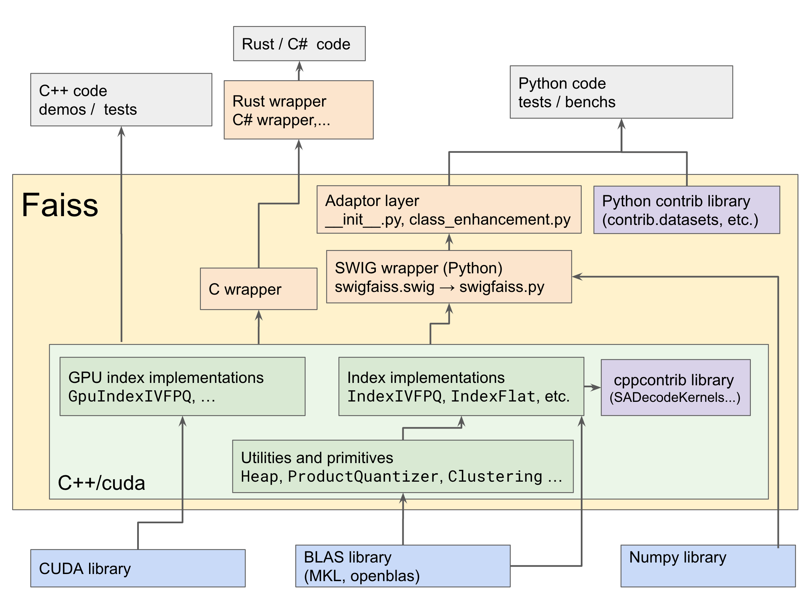

## Overall architecture 

Faiss has a layered architecture that uses several computer languages.



## Compilation 

A Makefile compiles Faiss and its Python interface. It depends on Makefile variables that set various flags (BLAS library, optimization, etc.), and that are set in makefile.inc. See [INSTALL](https://github.com/facebookresearch/faiss/blob/master/INSTALL.md) on how to set the proper flags.

## Dependencies 

The only hard dependency of Faiss is BLAS/Lapack. It was developed with Intel MKL but any implementation that offers the API with fortran calling conventions should work. Many implementations are transitioning from 32- to 64-bit integers, so the type of integer that should be used must be specified at compile time with the `-DFINTEGER=int` or `-DFINTEGER=long` flag.

## CPU Faiss C++ coding conventions

The CPU part of Faiss is intended to be easy to wrap in scripting languages. The GPU part of Faiss was written separately and follows different conventions (see below).

### No public/private 

All objects are C++ structs, there is no notion of public/private fields. All fields can be accessed directly. This means there are not safeguards that can be implemented via getters and setters.

### Object ownership (C++) 

Faiss classes are intended to be as simple as possible so that the default copy constructors work as expected and the destructor is empty. 
There are a few exceptions, where an object A maintains a pointer to another object B. 
In this case, there is a boolean flag `own_fields` in A that indicates whether B should be deleted when A is deleted. 
The flag is set to false (not owned) by constructors. 
This will result in a memory leak if the reference to the B is lost in the calling code. You can set it to true if you want object A to destroy object B when it is destroyed. Library function like `index_factory`, `load_index` and `clone_index`, that construct A and B set it to true.

| Class            | field    
|------------------|----------
|IndexIVF          | quantizer 
|IndexPreTransform | chain 
|IndexIDMap        | index 
|IndexRefineFlat   | base_index 

For example, you can construct an IndexIVFPQ in C++ with

```c++
  faiss::Index *index; 
  if (...) { // on output of this block, index is the only object that needs to be tracked
     faiss::IndexFlatL2 * coarseQuantizer = new  faiss::IndexFlatL2(targetDim);
     // you need to use a pointer here
     faiss::IndexIVFPQ *index1 = new faiss::IndexIVFPQ(
          coarseQuantizer, targetDim, numCentroids, numQuantizers, 8);
     index1->own_fields = true; // coarse quantizer is deallocated by index destructor
     index1->nprobe = 5; 
     index = index1;
  }  
```

There is no shared_ptr implemented, mainly because it is hard to make it work with the ref-counts managed by Lua and Python.

### Object ownership (Python)

SWIG generates a Python objects to wraps all C++ objects accessed in Python. 
When the object is constructed in Python (eg. via a constructor or `read_index`), the C++ object is deleted when the Python object is deleted. 
For composite objects constructed in Python, like 
```python
  def make_index():
      coarseQuantizer = faiss.IndexFlatL2(targetDim)
      index = faiss.IndexIVFPQ(
          coarseQuantizer, targetDim, numCentroids, numQuantizers, 8)
      index.nprobe = 5        
      return index
```
The C++ object's `own_fields` is set to `false` (the default), so Python needs to keep track of the object ownership. 
For this, constructors that take object arguments also add the object to `referenced_objects`, a Python list added dynamically to the python object.
To give constructors this property, they are passed to [`add_ref_in_constructor`](https://github.com/facebookresearch/faiss/blob/main/faiss/python/__init__.py#L157). 

A simple test to see if the object ownership works is to compare: 
```python 
b = B()
a = a(b)
a.do_something()
```

and 

```python
a = a(B())
a.do_something()
```
If the second version crashes (segfault) and the first does not, it means that something is messed up with object ownership. 

## Coding conventions

Faiss is written using C++17. Avoid using templates in user-exposed code. Virtual functions are ok.

Class names are CamlCase, methods and fields are lower_case_with_underscores (like in Python). All classes have a constructor without parameters that initializes parameters to some reproducible default. Indentation is 4 spaces for C++ and Python. This is enforced via clang-format, please run it before submitting a PR.

Do not use `long`, `long long`, `char` (except for strings) as they are not portable. 
Use explicitly sized types like `uint8_t`, `int64_t` for any integer type in an array. 

### GPU Faiss coding conventions

The GPU Faiss index objects inherit from the CPU versions and provide some (but not all) of the same interface. For various reasons, not all of the CPU interface functions could be implemented, but the main ones are implemented. Getters and setters are preferred as there are often state implications on the GPU for changes (and certain errors need to be enforced). As a result, there is some degree of mismatch between GPU and CPU APIs, which we may attempt to clean up in the future.

`.cu` and `.cuh` files potentially contain CUDA and are meant for compilation (and inclusion) by `nvcc`. `.h` and `.cpp` files are meant for compilation by the host compiler. Linking is best done with `nvcc`, as it "knows" which cuda libraries to link in. 

## Inclusion in external projects

By convention, Faiss .h files are referred to as `<faiss/...>`. For example, use 

``` c++
#include <faiss/IndexIVFPQ.h>
#include <faiss/gpu/GpuIndexFlat.h>
```

## C++ code wrapping

The C++ code can be called in Python thanks to [SWIG](http://swig.org/exec.html). SWIG parses the Faiss header files and generates classes in Python for all the C++ classes it finds. 

The SWIG module is called `swigfaiss` in Python, this is the low-lever wrapper. 
The functions and class methods can be called transparently from Python. 

The `faiss` module is an additional level of wrapping above `swigfaiss`. It that exports all of swigfaiss, chooses between the GPU and CPU-only version of Faiss and adds functions and methods to Faiss classes.

### Handling of C++ pointers

The only tricky part is when the C++ classes expect pointers to arrays. SWIG does not automatically handle these. Therefore, the Faiss SWIG wrapper `faiss.py` adds the following: 

- a function to extract a SWIG pointer from the data in an array: this is `swig_ptr(numpy.array)`. The functions are type-checked and they check if the array is C-compact, but there is no protection against NULL/nil/None and no verification of the array size, so is may cause the usual C/C++ crashes or memory corruptions.

- for the most common functions (`Index::train`, `Index::add`, `Index::search`, etc.) a specific wrapper was written to accept arrays in the scripting language directly, and verify their sizes. The original function is moved aside (eg. `train` -> `train_c`) and replaced with a wrapper function that does the proper type conversion.

- to convert a `std::vector<> v`  to a numpy array, use `faiss.vector_to_array(v)`, this copies the data to numpy (works for vectors of scalar elements).

- to copy the content of a numpy array to a `std::vector<> v`, use `faiss.copy_array_to_vector(a, v)`. The vector will be resized and will contain only the data of `a`.

- to create a numpy array that references a `float* x` pointer, use `rev_swig_ptr(x, 125)`. The numpy array will be 125 elements long. The data is not copied and size is not checked. To use this with `std::vector<float>`'s use the `.data()` method of the vector to get the pointer to its data.
