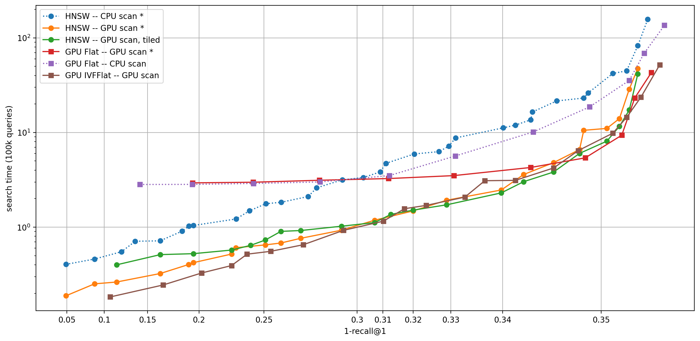
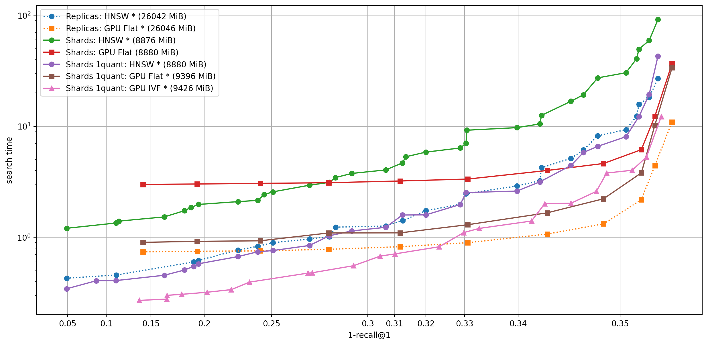
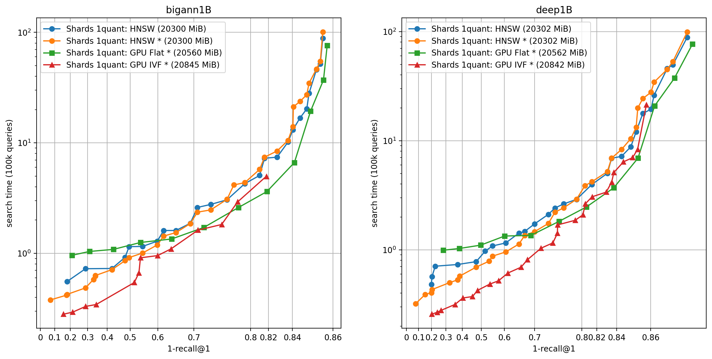

This is a series of experiments on how to best exploit GPUs for large IVF indexes. 

## Setup

Unless stated otherwise, they are performed on a Xeon E5-2698 v4 @ 2.20GHz with 1 to 4 Volta-class GPUs with 32 GB RAM.

The test dataset is BigANN, 1B database vectors, 100k queries (obtained by duplicating the 10k standard queries). 
The query batches are intentionally large because this is the regime where the GPU is the most efficient.
The dataset was built beforehand with the factory string `OPQ16_128,IVF1048576_HNSW32,PQ16`, ie. there are 1M centroids and the PQ compression is set to 16 bytes (this is so that an index fits on a single GPU). The accuracy measure is 1-recall@1. Due to the strong compression, the maximum recall @ 1 that can be obtained is ~0.352 (with maximum `nprobe`). 

The results are obtained by varying the runtime parameters of the search, see [Auto-tuning the runtime parameters](https://github.com/facebookresearch/faiss/wiki/Index-IO,-cloning-and-hyper-parameter-tuning#auto-tuning-the-runtime-parameters), but using a different autotuning implementation because some of the index types are simulated in Python. 

## Single GPU experiments

On a single GPU, the degrees of freedom are: 

* run the coarse quantization on CPU or GPU. On GPU the coarse quantizers are limited. 

* run the inverted list scanning on CPU or GPU. 

* if they are run on different platforms, then it is possible to run them in parallel by tiling the computations, ie. when the coarse quantizer processes queries 1000..1999, the scanning code processes 0..999. 

The achievable tradeoffs are: 

For each plot, the platoform of the coarse quantizer is indicated first then that of the inverted list scanning. 
The indexes that work out-of-the-box are indicated with `*`. Others are simulated in Python with `search_precomputed`. 
Note that the x-axis is scaled arbitrarily to show all operating points.

Observations: 
* CPU scanning is not competitive -- the index should be on GPU
* A non-exhaustive coarse quantizer is important for almost all operating points: can be a GPU IVFFlat or a HNSW
* Tiling the computation helps only marginally (the tile size here is 16384)
* The supported indexes cover the optimal operating points quite well. For example to obtain a HNSW coarse quantizer and inverted lists on GPU, use `index_cpu_to_gpu` on the index, since that will not convert the HNSW coarse quantizer to GPU. 

## Multiple GPU experiments 

Here we run the same experiment with 4 GPUs, and we keep only the options where the inverted lists are stored on GPU. 
In that case, in addition to the CPU / GPU options, we have the option to make replicas of the dataset or shard it (see [the Faiss paper](https://arxiv.org/abs/1702.08734), section 5.4). 

Observations: 
* Using replicas gets the best results for most operating points, but this is not possible when GPU RAM is the limiting factor, then shards are the only option (set `GpuMultipleClonerOptions.shard = true`)
* Sharding with a common quantizer (implemented in `IndexShardsIVF`) gets the best operating points. This is enabled via `GpuMultipleClonerOptions.common_ivf_quantizer = true`
* in this setting the ratio of GPU compute over CPU compute increases, so it becomes less interesting to use the CPU (HNSW) to do coarse quantization
* the best coarse quantizers are the GPU IVFFlat and the Flat one, depending on the operating point. 

## Larger codes

To reach higher precisions (and fully use the GPU memory), the size of the codes must be increased. This is possible up to 64 bytes per vector in this case. We do an additional experiment on the Deep1B dataset. 

* In these cases the best options are either the IVF Flat coarse quantizer or the flat one
* The cost of the list scanning is relatively more important than for smaller codes. 

Code for the benchmark: [bench_hybrid_cpu_gpu.py](https://github.com/facebookresearch/faiss/blob/main/benchs/bench_hybrid_cpu_gpu.py)

Run script: [run_on_cluster.bash](https://gist.github.com/mdouze/9ba876da1811de1164d9cae7b24885d6#file-run_on_cluster-bash)

Plot results: [plot_hybrid_cpu_gpu.ipynb](https://gist.github.com/mdouze/6f637a70dde083f291732b038683fa33#file-plot_hybrid_cpu_gpu-ipynb)
