This page gives some advice and results on datasets of around 1M vectors. 

## Guidelines (outdated) 

When the dataset is around 1m vectors, the exhaustive index becomes too slow, so a good alternative is `IndexIVFFlat`. It still returns exact distances but occasionally misses a neighbor because it is non-exhaustive. 

<details><summary> Experiments from 2018 </summary>

Below are a few experiments on datasets of size 1M with different indexing methods. We focus on the tradeoff between:

- speed, measured on a "Intel(R) Xeon(R) CPU E5-2680 v2 @ 2.80GHz" with 20 threads enabled. It is reported in ms in batch mode (ie. all query vectors are handled simultaneously). 
- accuracy. We use the //1-NN recall @R// measure with R=1, 10, or 100. This is the fraction of query vectors where the actual nearest-neighbor is ranked in the R first results. 

WARNING: This is an optimistic setting, running with a single thread is about 10x slower and providing queries one by one is another 2-3x slower (see the timings for sift_1M below)

The index types that are tested are referred to by their index key, as created by the `index_factory`.

For all indexes, we request 100 results per query. 

## CNN activation maps 

We use 4096D descriptors extracted from 1M images, and the same from query images. The 4096D descriptors are then reduced to 256D by PCA (beforehand, the cost of the PCA transformation is not reflected in the results). The most appropriate indexes for this are:

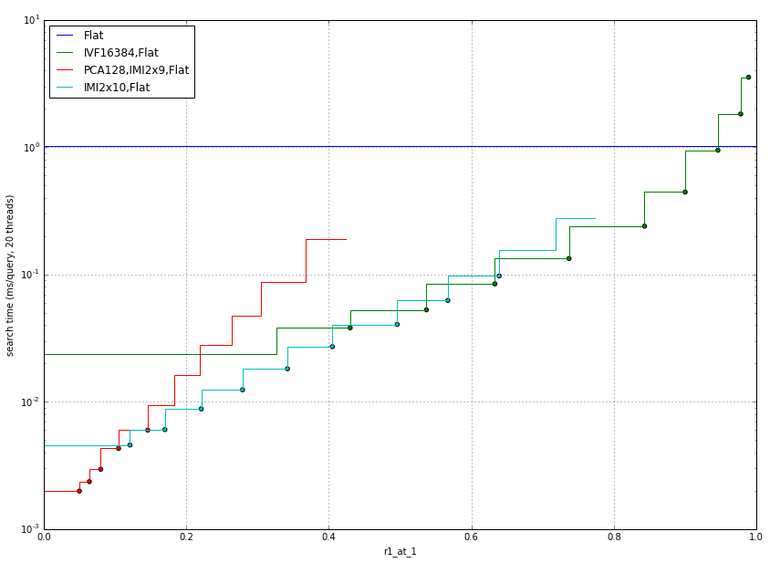

So an IVF is better for high accuracy regimes, and IMI for lower regimes.

NOTE: IVF16384 gives slightly better results than IVF4096, but the later is significantly cheaper to do `train` and `add`'s (this cost is not reflected in the measurements).

If memory is a concern, then compressed vectors can be used (with `IndexIVFPQ`)

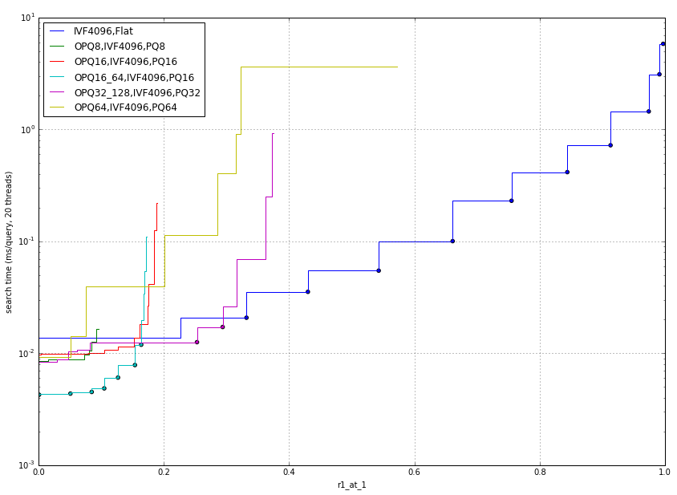

IVF4096,Flat is plotted only for reference.

For example: `OPQ32_128,IVF4096,PQ32` uses size of the code + id = 32 + 8 = 40 bytes per vector. This makes is total of 40MB total for the database, but there are overheads due to precomputed tables, geometric array allocation, etc.

We also use resnet-34 descriptors trained on Imagenet and computed on the 1M first images of Flickr100M, from which we remove the two upper layers to get 512D activation maps. The behavior is similar:

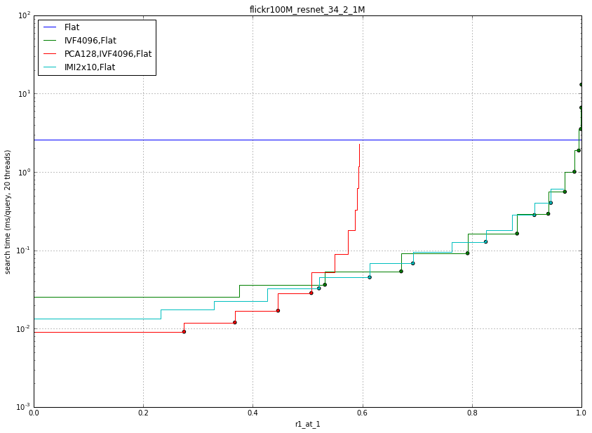

## SIFT 1M 

This is a common benchmark used in research papers. It consists of SIFT descriptors (128D) extracted from image patches. 

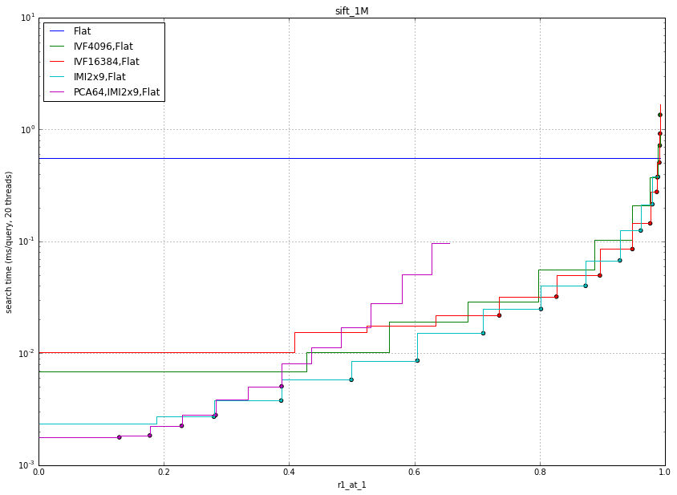

The comments are about the same as for the CNN data.

Here we also evaluated the performance in relation with threading and batching:

- nt1: batched, single-thread

- nobatch/nobatch_nt1: queries are submitted 1 by 1

- parallelqueries: queries are submitted in parallel 1 by 1, and processed by a non-batch loop.

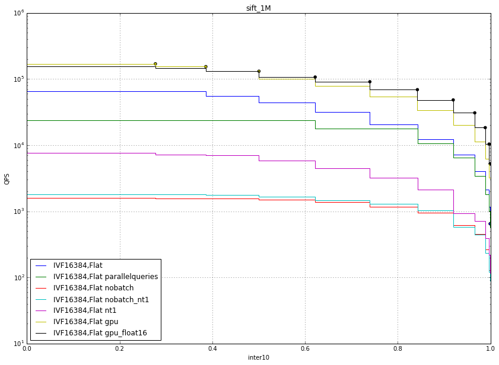

It appears that a 1-thread run is 5x to 12x slower. To submit queries one at a time, threading is not useful.  

NOTE: in this plot we report the speed in QPS (queries per second) and the x-axis is the 10-precision at 10 measure (or intersection measure). This is for easy comparison with [nmslib](https://github.com/searchivarius/nmslib#nmslib-is-generic-yet-fast), which is the best [library on this benchmark](https://github.com/erikbern/ann-benchmarks). 

A comparison with the benchmarks above is not accurate because the machines are not the same. 
A direct comparison with nmslib shows that nmslib is faster, but uses significantly more memory. For Faiss, the build time is sub-linear and memory usage is linear.

|                      | search time | 1-R@1    | index size   | index build time 
|----------------------|-------------|----------|--------------|-----------------
| Flat-CPU             |  9.100 s    |  1.0000  | 512 MB       | 0 s
| nmslib (hnsw)        |  0.081 s    |  0.8195  | 512 + 796 MB | 173 s
| IVF16384,Flat        |  0.538 s    |  0.8980  | 512 + 8 MB   | 240 s
| IVF16384,Flat (Titan X)| 0.059 s   |  0.8145  | 512 + 8 MB   | 5 s
| Flat-GPU (Titan X)   |  0.753 s    |  0.9935  | 512 MB       | 0 s

The first row is for exact search with Faiss. The two last results are with a GPU (Titan X). The Flat indexes are brute force indexes that return exact results (up to ties and floating-point precision issues). 

## Twitter glove 

This is used as a benchmark by Annoy. The performance measure is different: intersection of the found 10-NN with the GT 10-NN. 

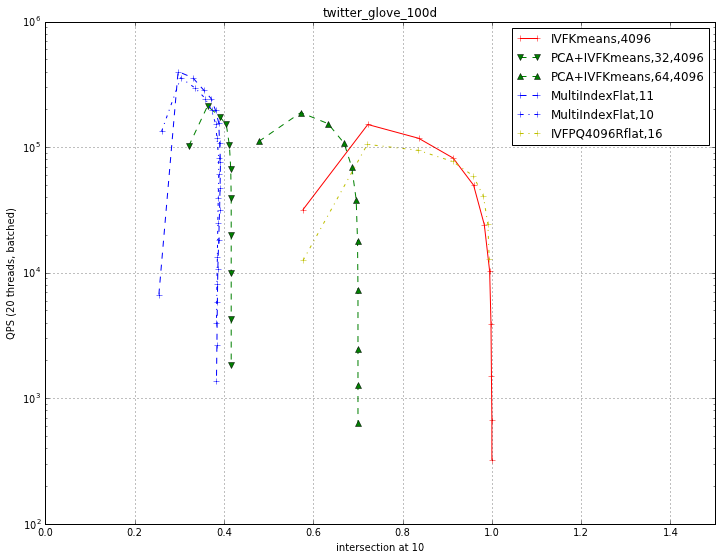

The IVFPQ followed by a verification improves the results slightly.

## Random data 

We use data sampled uniformly on a unit sphere in 128D. This is the hardest data to index because there is no regularity whatsoever that the indexing method can exploit.

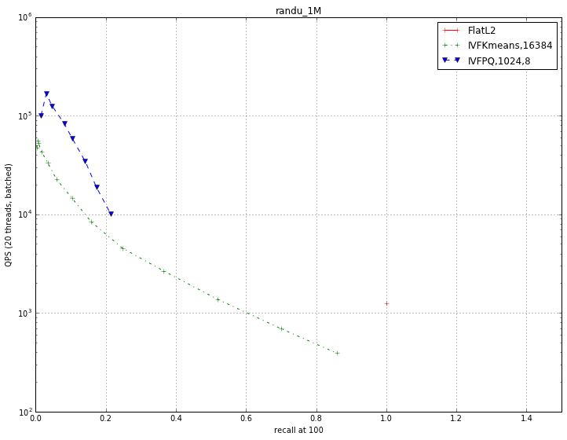

The measured performance is recall @ 100, otherwise it would be too low. Here, for most operating points, doing a brute-force computation is the best we can do.

</details>

# HNSW benchmarks

There are several uses of HNSW as an indexing method in FAISS:

- the normal HNSW that operates on full vectors

- operate on quantized vectors (SQ)

- as a quantizer for an IVF

- as an assignment index for kmeans 

The various use cases are evaluated with [`benchs/bench_hnsw.py`](https://github.com/facebookresearch/faiss/blob/master/benchs/bench_hnsw.py) on SIFT1M. The output looks like (with 20 threads):

```
  testing HNSW Flat
  efSearch 16        0.011 ms per query, R@1 0.8740
  efSearch 32        0.020 ms per query, R@1 0.9492
  efSearch 64        0.033 ms per query, R@1 0.9779
  efSearch 128       0.059 ms per query, R@1 0.9887
  efSearch 256       0.104 ms per query, R@1 0.9920

  testing HNSW with a scalar quantizer
  efSearch 16        0.005 ms per query, R@1 0.7281
  efSearch 32        0.008 ms per query, R@1 0.8506
  efSearch 64        0.011 ms per query, R@1 0.9242
  efSearch 128       0.020 ms per query, R@1 0.9566
  efSearch 256       0.039 ms per query, R@1 0.9716

  testing IVF Flat (baseline)
  nprobe 1           0.076 ms per query, R@1 0.4085
  nprobe 4           0.067 ms per query, R@1 0.6331
  nprobe 16          0.078 ms per query, R@1 0.8263
  nprobe 64          0.141 ms per query, R@1 0.9470
  nprobe 256         0.344 ms per query, R@1 0.9861

  testing IVF Flat with HNSW quantizer
  nprobe 1           0.007 ms per query, R@1 0.4058
  nprobe 4           0.010 ms per query, R@1 0.6305
  nprobe 16          0.021 ms per query, R@1 0.8247
  nprobe 64          0.063 ms per query, R@1 0.9462
  nprobe 256         0.220 ms per query, R@1 0.9842
```

The comparisons show: 

- HNSW obtains much better speed / precision operating points than IVFFlat (eg. 0.020 ms vs. 0.140 ms to get > 0.9 recall at 1), at a higher memory cost

- HNSW with a scalar quantizer is better than the classical HNSW (note that that SIFT1M is originally encoded in bytes)

- using HNSW as a quantizer on top of a memory-efficient IVF improves the search speed (the performance is similar to an IMI quantizer, but clusters are more balanced)

Tests on kmeans clustering:

```
  performing kmeans on the sift1M vectors (baseline)
  Clustering 1000000 points in 128D to 16384 clusters, redo 1 times, 10 iterations
    Preprocessing in 0.17 s
    Iteration 9 (612.53 s, search 612.18 s): objective=3.85228e+10 imbalance=1.235 nsplit=0

  performing kmeans on the sift1M using HNSW assignment
  Clustering 1000000 points in 128D to 16384 clusters, redo 1 times, 10 iterations
    Preprocessing in 0.17 s
    Iteration 9 (74.63 s, search 73.46 s): objective=3.85232e+10 imbalance=1.234 nsplit=0
```

ie. the clustering is 8.2x times faster than with an exhaustive assignment, without impacting the objective value or increasing the number of empty clusters (nsplit) or imbalance factor, both are signs of unhealthy clusters.

# 4-bit PQ: comparison with SCANN

There is an efficient 4-bit PQ implementation in Faiss. 
We compare the Faiss fast-scan implementation with Google's [SCANN](https://github.com/google-research/google-research/tree/master/scann), version 1.1.1. 
The 4-bit PQ implementation of Faiss is heavily inspired by SCANN. 
The data layout is tuned to be efficient with AVX instructions, see [simulate_kernels_PQ4.ipynb](https://gist.github.com/mdouze/5c32300cf3bd20946a7762f6c016e823).

<details><summary> details </summary>

Here we set the number of search threads to 1. 
For all benchmarks we report plots of an accuracy measure (x-axis) vs. the number of queries per second (QPS, y-axis): up and right is better.
All experiments were performed on a normalized platform (2.2 GHz Xeon E5-2698, 80 cores). 

We use four 1M-sized datasets: 

- SIFT1M: classical dataset of SIFT vectors in 128 dim

- Deep1M: dataset of 96-dim L2 normalized deep features 

- glove-100: the dataset used in [ANN-benchmarks](https://github.com/erikbern/ann-benchmarks), comparison in cosine distance (`faiss.INNER_PRODUCT`).

- music-100: a dataset for maximum inner product search introduced in [Morozov & Babenko, "Non-metric similarity graphs for maximum inner product search." NIPS'18](https://proceedings.neurips.cc/paper/2018/hash/229754d7799160502a143a72f6789927-Abstract.html).

We used the recommended settings from SCANN on all datasets: 
in Faiss terms it means a factory string of `IVF2000,PQ`_dim/2_`x4fs,RFlat` (we test with and without the RFlat reranking step).
We get 10 results per query vector. When re-ranking (RFlat), we instead search 100 vectors and rerank those with exact distance computations. 

### Results on SIFT1M

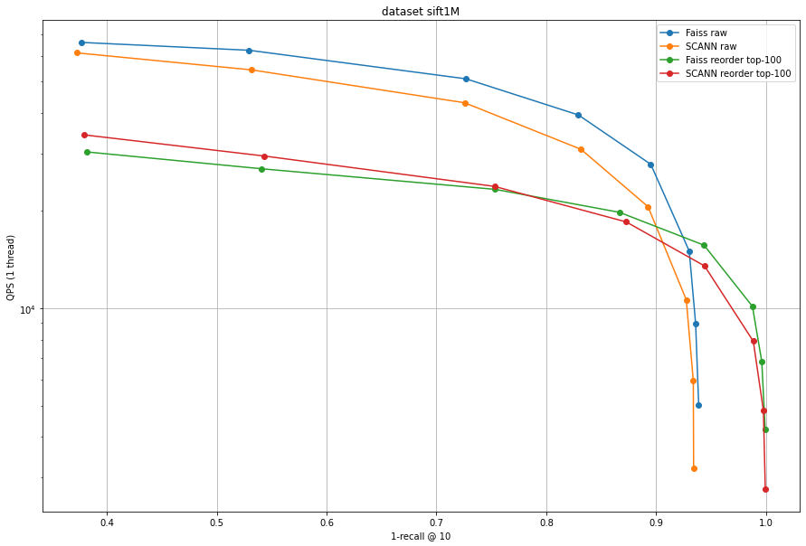

Here Faiss is faster and more accurate than SCANN for all operating points before re-ranking, and for most operating points after re-ranking.

### results on Deep1M

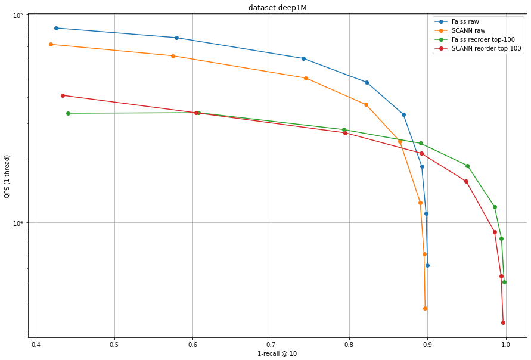


Same conclusion as for SIFT1M.

### results on GloVE

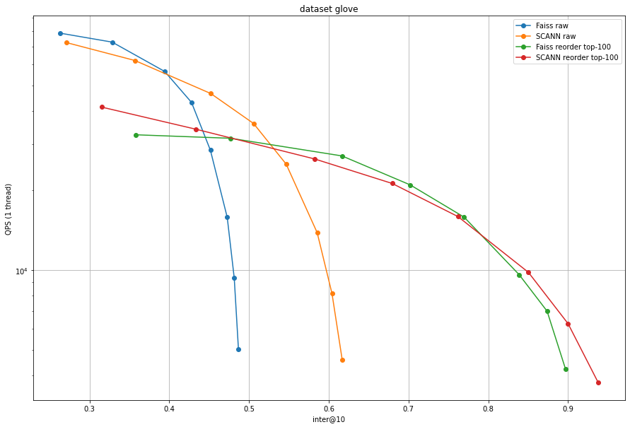

Note that here we use the original accuracy measure used in ANN benchmarks (inter @ 10) instead of the 1-recall@10 in the other plots.

Glove has a specific data distribution due to the way the vectors are trained. 
SCANN includes an anisotropic quantization (see [Accelerating Large-Scale Inference with Anisotropic Vector Quantization, Guo et al, ICML'20](http://proceedings.mlr.press/v119/guo20h/guo20h.pdf)) technique that improves the accuracy in this case.
However, after re-ranking the difference is not so strong anymore, and Faiss is even better on some operating points.
Therefore, we do not consider it urgent to add an implementation of anisotropic quantization to Faiss.

### results on music-100

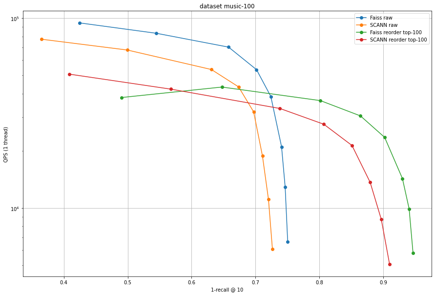

The improvement of Faiss over SCANN is larger for Music-100 than for the L2 datasets. 
This shows that the anisotropic quantization used in SCANN is not useful for all maximum inner product use cases.

This experiment shows that the Faiss implementation of 
is on-par and often better than the SCANN implementation 

</details>

Note that in reality, one would use multiple threads and add a refinement stage, which we do in the following experiments.

# Benchmarks

For all benchmarks we report plots of an accuracy measure (x-axis) vs. the number of queries per second (QPS, y-axis): up and right is better.
All experiments were performed on a normalized platform (2.2 GHz Xeon E5-2698, 80 cores).
We did perform all experiments with 32 corse, which is a relatively common setup.

The search depends on parameters, for example the nprobe parameter that indicates the number of quantizer cells to visit per query. 
To set them, we use the [auto-tuning functionality of Faiss](https://github.com/facebookresearch/faiss/wiki/Index-IO,-cloning-and-hyper-parameter-tuning#auto-tuning-the-runtime-parameters) that find the set of Pareto-optimal search parameters in an index.

## Preliminary experiment: IVF encoding

We start with a small exploration: on SIFT1M we compare the fast-scan version of PQ with the widely used PQ8 and scalar quantizers. 
The dataset is first split in an IVF1024. 

The results are below: 
<details><summary>IVF1024 -- encodings</summary>

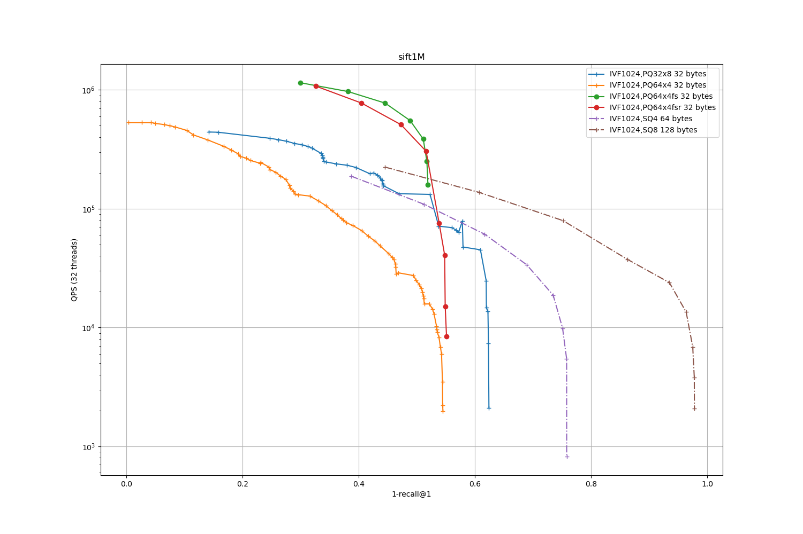

</details>

The labels of each plot also report the number of bytes per stored vector. 
This does not matter much for 1M-sized datasets but at a larger scale it 

Observations: 

- for the low-accuracy regime, the fast-scan PQ4 implementation offers the best tradeoff

- for the high-accuracy regime, HNSW has the best ones.

- the PQ64x4fs plot has limited accuracy topline, it is even lower than the PQ64x4 without fs because the later uses a residual encoding and float32 look-up tables (it is of course much slower)

- the PQ64x4fsr is slightly slower than PQ64x4fs but has a bit higher topline accuracy. This is because it encodes residual vectors. For larger vocabularies, the impact of the residual vectors is stronger.

## Preliminary experiment: IVF re-ranking

Then we aim at measuring the impact of re-ranking with exact or near exact distances on a shortlist of results. 

<details><summary>IVF1024 -- reranking</summary>

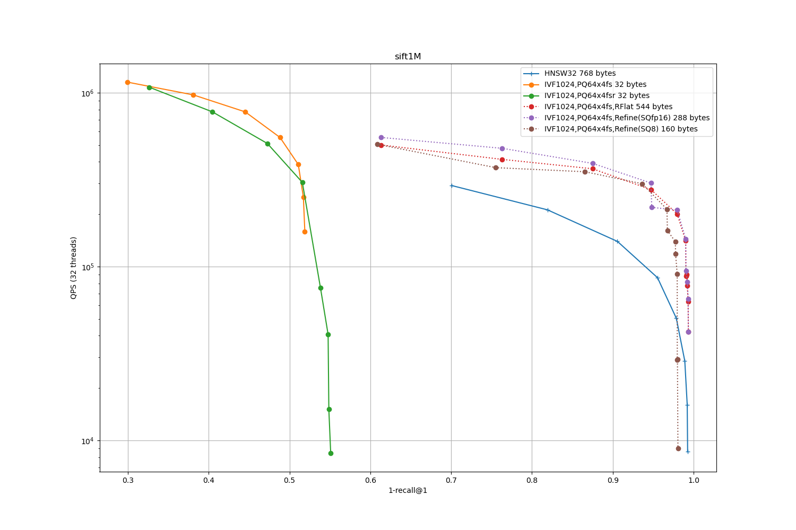

</details>

Observations: 

- the re-ranking options offer better operating points than HNSW

- reranking has one more search-time parameter: `k_factor_rf`. Thus, re-ranking is harder to tune and the curves are more irregular.

- the encoding used at re-ranking time has little impact on search speed and a small impact on accuracy. The amount code size stored per vector can be reduced substantially with a small impact on recall. 

For illustration, here are the parameters for the optimal points of the `IVF1024,PQ64x4fs,RFlat`: [gist](https://gist.github.com/mdouze/f947df99252516fb16c0cf3697c3d3df). 
Note that the re-ranking is performed at least on k=100 results, therefore, `k_factor_rf=1` already obtains good results in terms of 1-recall@1.

## Results on SIFT1M and Deep1M

We did extensive experiments on the two datasets, so to make the result plots more readable, we broke them down a "small" and a "large" class. 

Small setting (<64 bytes per vector): 

<details><summary>SIFT1M -- small</summary>

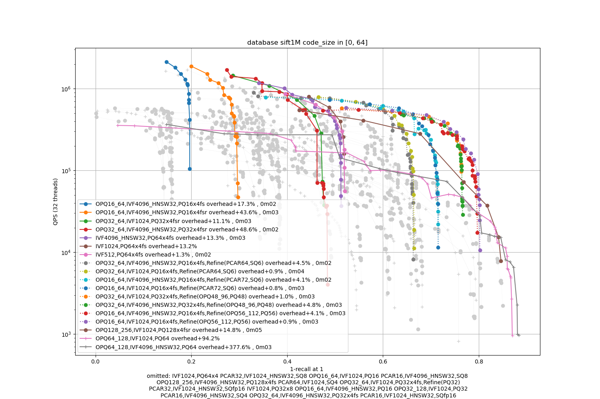

</details>

<details><summary>Deep1M -- small</summary>

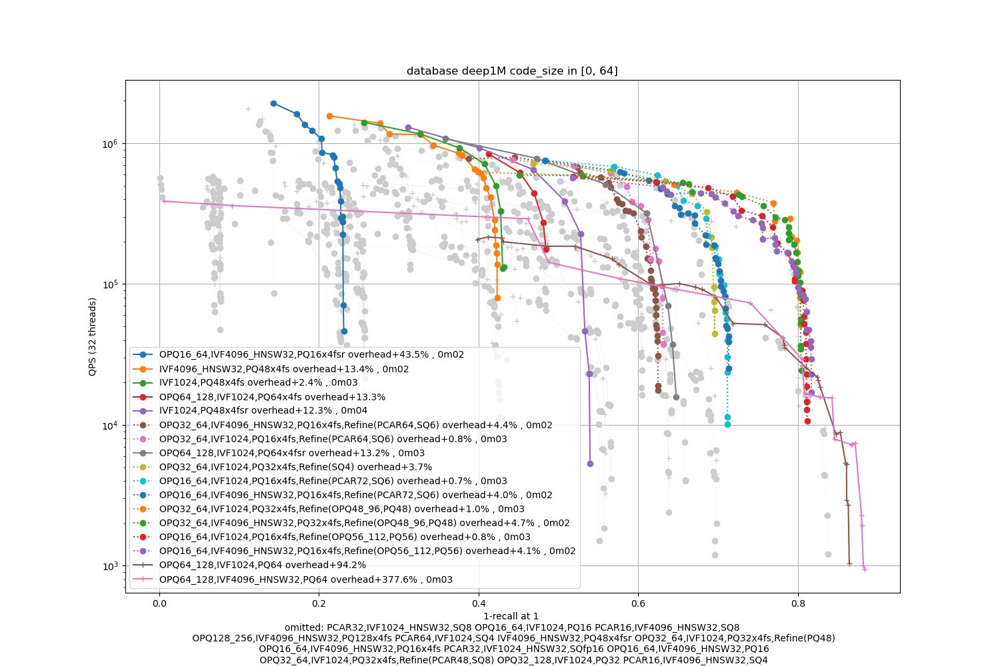

</details>

Observations: 

- the optimal accuracy is dependent on the encoding size. 

- The PQ fast-scan options outperform the other PQ and SQ variants except for the most accurate operating points

- refinement variants are useful for the higher part of the range

<details><summary>SIFT1M -- large</summary>

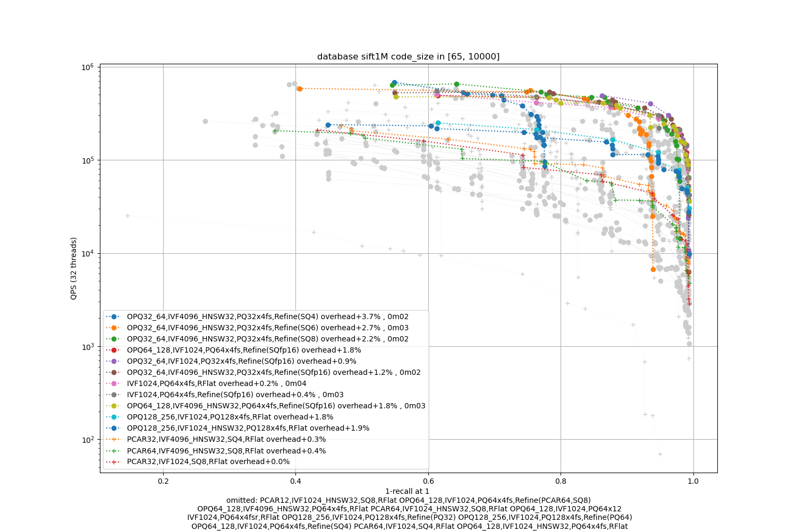

</details>


<details><summary>Deep1M -- large</summary>

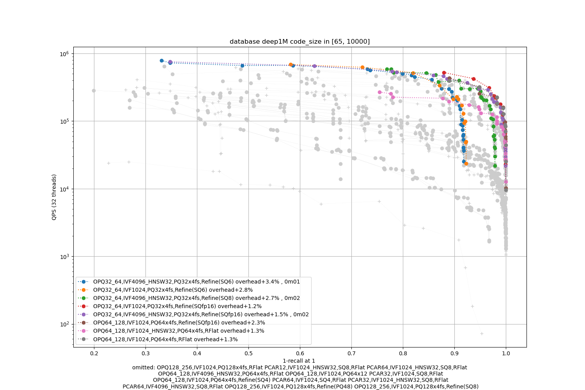

</details>

Observations: 

- the most effective methods include a refinement stage, and Refine(SQfp16) is a good option 

- the coarse quantizer (IVF1024 or IVF4096_HNSW32) does not matter much.

## GloVe and music-100

These maximum inner product datasets are of dimension 100. We did experiments without the OPQ pre-processing.

<details><summary>Glove</summary>

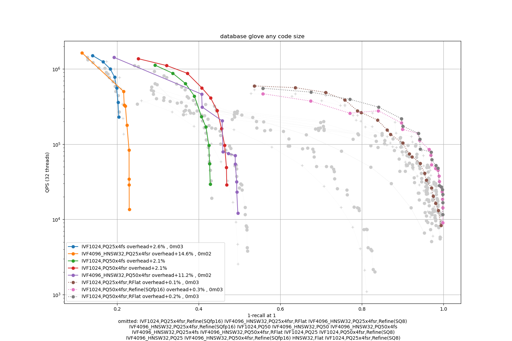

</details>

<details><summary>Music-100</summary>


</details>

Observations: 

- refinement indexes obtain the highest operating points

- PQ variants are not competitive 

- HNSW is competitive in the high-accuracy regime for Music-100

