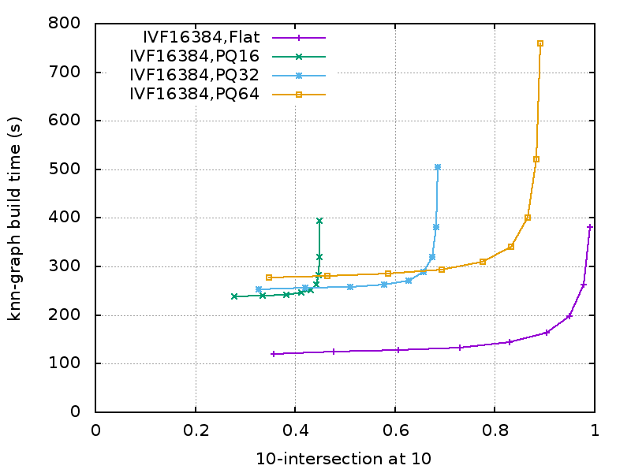

Here we present a few benchmarks for the low-level aspects of Faiss.

## kmeans on 1M vectors 

The Faiss kmeans implementation is fairly efficient. Clustering n=1M points in d=256 dimensions to k=20000 centroids (niter=25 EM iterations) is a brute-force operation that costs n * d * k * niter multiply-add operations, 128 Tflop in this case. 

The Faiss implementation takes:

- 11 min on CPU

- 3 min on 1 Kepler-class K40m GPU

- 111 sec on 1 Maxwell-class Titan X GPU

- 55 sec on 1 Pascal-class P100 GPU (float32 math)

- 52 sec on 4 Kepler-class K40m GPUs

- 35 sec on 4 Maxwell-class Titan X GPUs

- 34 sec on 1 Pascal-class P100 GPU (float16 math)

- 21 sec on 8 Maxwell-class Titan X GPUs

- 21 sec on 4 Pascal-class P100 GPUs (float32 math)

- 16 sec on 4 Pascal-class P100 GPUs (float16 math) 
*** (majority of time on the CPU)

- 14 sec on 8 Pascal-class P100 GPUs (float32 math) 
*** (problem size too small, majority of time on the CPU and PCIe transfers!)

- 14 sec on 8 Pascal-class P100 GPUs (float16 math) 
*** (problem size too small, bottlenecked on GPU by too small Hgemm size, majority of time on the CPU and PCIe transfers!)

See the benchmarking code here: TODO.

## kmeans on 95M vectors 

It is also possible to cluster larger datasets, as long as the training set fits in RAM. Here we test on 95M vectors in 128D (48G RAM). The clustering to 85k centroids takes less than 1h on 7 TitanX's, code at TODO 

These results show that up to this scale it is not necessarily useful to implement clever clustering techniques, since brute-force kmeans is fast enough. 
 
## Construction of a knn-graph 

We tested Faiss to construct a brute-force knn-graph (with k=10) on 10M images represented by 128D vectors. We measure the tradeoff between:

- efficiency: we measure how much time it takes to construct the whole knn-graph on 8 M40 GPUs. 

- quality: To estimate the accuracy of the knn-graph construction, we sample 10k images for which we compute the exact nearest neighbors. Our accuracy measure is the fraction of 10 found nearest neighbors that are within the ground-truth 10 nearest neighbors.

Overall, if memory is not a concern (and 8 GPUs can fit 100M vectors easily), the IVFFlat is both faster and more accurate. 

Code for this benchmark: TODO.