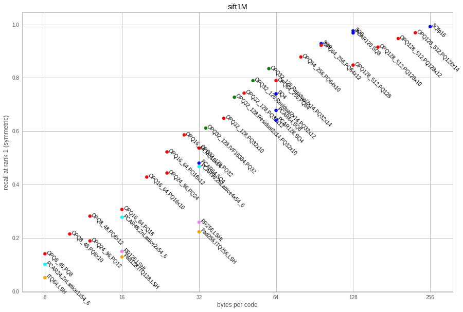
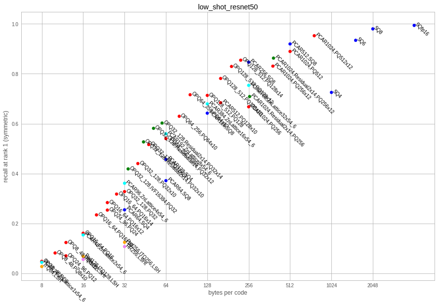
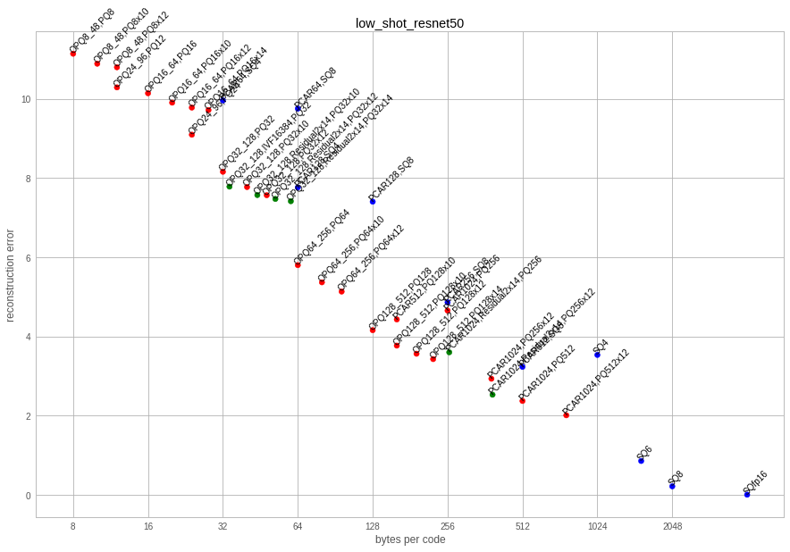
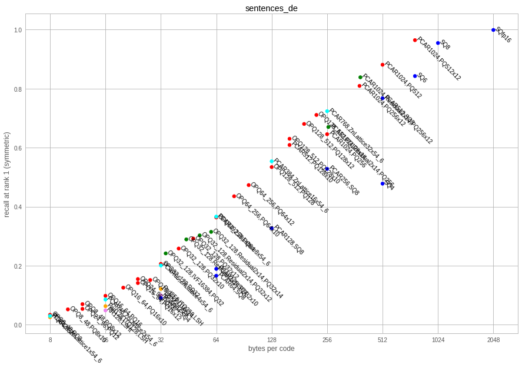

We compare the vector codecs on a few datasets that hopefully are representative of real use cases.

For all cases, the procedure is the same: we instantiate the codec with an `index_factory`. 
Then we train it on 1M representative vectors. 
Then we evaluate: 
- the **reconstruction error** on an independent set of 1M vectors. The reconstruction is the average L2 error (non squared) after encoding and decoding back. Note that some codecs do not support reconstruction (ITQ) in a meaningful way.
- the **symmetric similarity search accuracy** (as 1-nearest-neighbor recall at rank 1). We use 10k vectors, that we encode/decode and search the nearest neighbors in the 1M previous vectors (that are also encoded/decoded). This reflects how much the codec destroyed the discriminative ability of vectors. For binary codecs, we use the Hamming distance to evaluate this.
- the **asymmetric similarity search accuracy**. This is the same as above, except that the queries are _not_ encoded. This reflects a use case where query vectors that are immediately available are compared against encoded vectors from a database.

We report these measures in tables, sorted by increasing code size.
We also show plots of the symmetric search accuracy. 
The codecs we tested were chosen from a reasonable set of baselines. 
It is possible that a bit more of fine-tuning can increase their performance. 

These experiments have not been updated to include additive quantization options, which currently offer the best accuracy vs. memory usage tradeoffs. 
Please refer to the [additive quantizers wiki](https://github.com/facebookresearch/faiss/wiki/Additive-quantizers) for results on these. 

# SIFT1M

This is a very classical academic dataset of 1M SIFT vectors in 128D. The vectors come encoded as bytes, so it does not make sense to use more than 128 bytes to encode it. 

The table below reports the most interesting operating points:

| factory key | code size | codec size | recons error | sym recall @ 1 | asym  recall @ 1 | decode time |
|:------------|----------:|-----------:|-------------:|---------------:|-----------------:|------------:|
| ITQ64,LSH                      |     8 |    48.7 k |      - |  0.051 |      - |      - |
| OPQ8_48,PQ8                    |     8 |    72.2 k |  308.2 |  0.141 |  0.220 |   0.23 |
| PCAR24,ZnLattice1x54_6         |    8 |     77.3 k  |      364 |  0.101 |  0.145 |   0.20 |   0.18 |
| OPQ8_48,PQ8x10                 |    10 |     216 k |  301.5 |  0.215 |  0.302 |   0.25 |
| OPQ8_48,PQ8x12                 |    12 |     792 k |  297.1 |  0.282 |  0.353 |   0.27 |
| Pad128,ITQ128,LSH              |    16 |     129 k |      - |  0.129 |      - |      - |
| OPQ16_64,PQ16                  |    16 |    96.2 k |  138.8 |  0.307 |  0.412 |   0.23 |
| OPQ16_64,PQ16x10               |    20 |     288 k |  125.9 |  0.428 |  0.504 |   0.28 |
| OPQ16_64,PQ16x12               |    24 |    1.03 M |  118.7 |  0.523 |  0.567 |   0.34 |
| Pad256,ITQ256,LSH              |    32 |     514 k |      - |  0.223 |      - |      - |
| PCAR64,SQ4                     |    32 |    97.9 k |  121.2 |  0.481 |  0.540 |   0.22 |
| PCAR96,ZnLattice4x54_6         |   32 |      114 k  |    98.18 |  0.468 |  0.572 |   0.60 |   0.38 |
| OPQ32_128,IVF16384,PQ32        |    34 |    8.19 M |  61.86 |  0.612 |  0.666 |   0.14 |
| OPQ32_128,PQ32x10              |    40 |     576 k |   56.2 |  0.649 |  0.718 |   0.57 |
| OPQ32_128,Residual2x14,PQ32x10 |    44 |    8.56 M |  45.34 |  0.727 |  0.764 |   0.11 |
| OPQ32_128,Residual2x14,PQ32x12 |    52 |    10.1 M |   36.2 |  0.789 |  0.809 |   0.11 |
| OPQ32_128,Residual2x14,PQ32x14 |    60 |    16.1 M |  29.55 |  0.835 |  0.850 |   0.14 |
| SQ4                            |    64 |     1105 |  42.19 |  0.740 |  0.780 |   0.03 |
| OPQ64_256,PQ64x10              |    80 |    1.13 M |  17.32 |  0.878 |  0.896 |   1.04 |
| SQ6                            |    96 |     1105 |  9.904 |  0.928 |  0.942 |   0.06 |
| OPQ64_256,PQ64x12              |    96 |    4.13 M |  10.12 |  0.922 |  0.933 |   1.25 |
| PCAR128,SQ8                    |   128 |     131 k |  3.201 |  0.968 |  0.977 |   0.38 |
| SQ8                            |   128 |     1105 |  2.468 |  0.976 |  0.979 |   0.04 |
| SQfp16                         |   256 |       81 |      0 |  0.992 |  0.992 |   0.03 |

nan means that the operation does not make sense (ITQ cannot reconstruct).
The decode time is indicated as seconds to decode 1M vectors on a full machine (48 threads).

We can make the following observations: 
- `ITQ64,LSH` is a very calssical binary hash. For all operating points, it is outperformed by the product quantizer variants and even the scalar quantizer. 
- PQ variants give very good similarity search results. However, note that the pre-processing (`OPQx`) requires to store a rotation matrix in the codec, which can make it large.
- for a given PQ size (eg. PQ16) increasing the number of bits per quantizer (beyond the default 8) is a good way to scale up the accuracy for a modest increase of code size
- residual codecs improve a bit over the PQ, but they are a lot slower to encode, and they require even more training data
- `SQ8` does not give 100% accuracy as it should because of quantization artifacts.
- OPQ and PCA matrices for this large datasets are bulky to store in the codec. Note that PCA matrices (but not OPQ) are stored twice, because the raw eigenvalues are kept. Hence, for a PCA with input dimension d, it is possible to subtract `d*d*4` bytes from the codec size.
- the lattice quantizer is better than ITQ but not as good as the scalar quantizer. This may be because the parameters were not optimized for such short vectors

# Resnet50

This is a dataset of 2048-dim vectors produced by the average pooling layer of a resnet50. The vectors come from the repository [low-shot-with-diffusion](https://github.com/facebookresearch/low-shot-with-diffusion).

| factory key | code size | codec size | recons error | sym recall @ 1 | asym  recall @ 1 | encode time | decode time |
|:------------|----------:|-----------:|-------------:|---------------:|-----------------:|------------:|------------:|
| ITQ64,LSH                      |    8 |     536 k |        - |  0.028 |      - |  42.41 |      - |
| OPQ8_48,PQ8                    |    8 |     432 k |    11.14 |  0.049 |  0.086 |  18.95 |   1.91 |
| PCAR24,ZnLattice1x54_6         |    8 |     16.2 M  |    12.67 |  0.045 |  0.060 |  18.93 |   1.21 |
| OPQ8_48,PQ8x10                 |   10 |     576 k |    10.89 |  0.082 |  0.129 |  23.43 |   1.95 |
| OPQ24_96,PQ12                  |   12 |     864 k |    10.29 |  0.071 |  0.129 |  14.53 |   0.94 |
| OPQ8_48,PQ8x12                 |   12 |    1.13 M |     10.8 |  0.124 |  0.171 |  40.86 |   0.79 |
| Pad128,ITQ128,LSH              |   16 |    1.07 M |        - |  0.069 |      - |  41.59 |      - |
| RR128,LSHt                     |   16 |       1 M |        - |  0.056 |      - |  18.27 |      - |
| OPQ16_64,PQ16                  |   16 |     576 k |    10.14 |  0.161 |  0.214 |  13.93 |   0.89 |
| OPQ16_64,PQ16x10               |   20 |     768 k |    9.904 |  0.235 |  0.278 |  15.74 |   0.86 |
| OPQ16_64,PQ16x12               |   24 |     1.5 M |    9.779 |  0.284 |  0.316 |  21.72 |   0.92 |
| OPQ16_64,PQ16x14               |   28 |     4.5 M |    9.717 |  0.318 |  0.342 |  45.72 |   0.92 |
| Pad256,ITQ256,LSH              |   32 |    2.26 M |        - |  0.125 |      - |  43.74 |      - |
| PCAR96,ZnLattice4x54_6         |   32 |     16.8 M  |     8.84 |  0.361 |  0.408 |  22.24 |   1.20 |
| PCAR64,SQ4                     |   32 |    16.5 M |     9.96 |  0.255 |  0.291 |  14.65 |   0.84 |
| OPQ32_128,IVF16384,PQ32        |   34 |    9.13 M |    7.783 |  0.419 |  0.486 |  23.32 |   0.86 |
| OPQ32_128,PQ32x10              |   40 |     1.5 M |    7.773 |  0.440 |  0.496 |  29.70 |   1.37 |
| OPQ32_128,Residual2x14,PQ32x10 |   44 |     9.5 M |    7.571 |  0.527 |  0.569 |  46.01 |   1.00 |
| OPQ32_128,PQ32x12              |   48 |       3 M |    7.566 |  0.516 |  0.554 |  32.23 |   1.22 |
| OPQ32_128,Residual2x14,PQ32x12 |   52 |      11 M |    7.472 |  0.582 |  0.609 |  57.47 |   0.91 |
| OPQ32_128,Residual2x14,PQ32x14 |   60 |      17 M |    7.415 |  0.603 |  0.615 |  95.27 |   0.71 |
| OPQ64_256,PQ64                 |   64 |    2.25 M |    5.801 |  0.540 |  0.609 |  17.50 |   1.47 |
| PCAR128,SQ4                    |   64 |      17 M |    7.763 |  0.457 |  0.515 |  14.18 |   1.03 |
| OPQ64_256,PQ64x10              |   80 |       3 M |    5.367 |  0.630 |  0.691 |  28.46 |   1.87 |
| OPQ64_256,PQ64x12              |   96 |       6 M |    5.134 |  0.716 |  0.756 |  47.76 |   1.93 |
| OPQ128_512,PQ128               |  128 |     4.5 M |    4.159 |  0.713 |  0.752 |  19.18 |   4.18 |
| PCAR128,SQ8                    |  128 |      17 M |    7.404 |  0.642 |  0.647 |  15.39 |   1.03 |
| PCAR384,ZnLattice16x54_6       |  128 |       19 M  |    4.688 |  0.679 |  0.737 |  19.05 |   2.75 |
| OPQ128_512,PQ128x10            |  160 |       6 M |    3.769 |  0.781 |  0.811 |  29.75 |   3.30 |
| OPQ128_512,PQ128x12            |  192 |      12 M |    3.564 |  0.829 |  0.851 |  76.59 |   4.11 |
| OPQ128_512,PQ128x14            |  224 |      36 M |    3.428 |  0.854 |  0.873 | 309.20 |   9.02 |
| PCAR256,SQ8                    |  256 |      18 M |    4.861 |  0.846 |  0.850 |  38.03 |   1.40 |
| PCAR1024,Residual2x14,PQ256    |  260 |      89 M |      3.6 |  0.709 |  0.769 |  60.21 |   4.64 |
| PCAR1024,Residual2x14,PQ256x12 |  388 |     104 M |    2.529 |  0.863 |  0.890 | 181.39 |   4.76 |
| PCAR512,SQ8                    |  512 |      20 M |    3.233 |  0.919 |  0.921 |  18.14 |   4.00 |
| PCAR1024,PQ512x12              |  768 |      40 M |     2.01 |  0.953 |  0.955 | 192.48 |  13.30 |
| SQ4                            | 1024 |    16.1 k |    3.534 |  0.725 |  0.760 |  50.48 |   0.57 |
| SQ8                            | 2048 |    16.1 k |   0.2162 |  0.980 |  0.982 |  16.80 |   0.58 |
| SQfp16                         | 4096 |        81 | 0.004493 |  0.994 |  0.994 |  15.67 |   0.53 |

Observations: 
- ITQ is again largely outperformed
- in high dimensions, the PQ codecs are easily > 100MB just to store the codec itself. The encoding time can also be prohibitive.
- in high dimensions, the scalar quantizer options are interesting, especially because they do not need large codecs 
- the residual codecs are a bit better than the scalar ones
- the lattice quantizer is competitive with OPQ variants for low bit rates (up to 32). It is much cheaper to train but a lot more expensive to code and decode.

## reconstruction error plot

For comparison, here is the reconstruction error plot. 
The recall measures and reconstruction are heavily correlated: the lower the reconstruction error, the better the retrieval performance.

# Sentence embeddings

This is a dataset with 1024-dim German sentences from the [LASER toolkit](https://github.com/facebookresearch/LASER). 

| factory key | code size | codec size | recons error | sym recall @ 1 | asym  recall @ 1 | encode time | decode time |
|:------------|----------:|-----------:|-------------:|---------------:|-----------------:|------------:|------------:|
| ITQ64,LSH                      |    8 |     276 k |        - |  0.025 |      - |  43.36 |      - |
| OPQ8_48,PQ8                    |    8 |     240 k |  0.04436 |  0.034 |  0.062 |   9.93 |   1.82 |
| PCAR24,ZnLattice1x54_6         |    8 |      4.1 M  |  0.04515 |  0.030 |  0.038 |   9.56 |   1.75 |
| OPQ8_48,PQ8x10                 |   10 |     384 k |  0.04405 |  0.052 |  0.080 |  13.59 |   0.47 |
| OPQ24_96,PQ12                  |   12 |     480 k |  0.04337 |  0.054 |  0.101 |   7.58 |   0.63 |
| OPQ8_48,PQ8x12                 |   12 |     960 k |  0.04384 |  0.070 |  0.090 |  33.32 |   0.47 |
| Pad128,ITQ128,LSH              |   16 |     580 k |        - |  0.063 |      - |  32.96 |      - |
| OPQ16_64,PQ16                  |   16 |     320 k |  0.04318 |  0.098 |  0.127 |  13.10 |   0.52 |
| OPQ16_64,PQ16x10               |   20 |     512 k |  0.04292 |  0.126 |  0.143 |  10.93 |   0.65 |
| OPQ16_64,PQ16x12               |   24 |    1.25 M |  0.04278 |  0.141 |  0.157 |  15.56 |   0.66 |
| OPQ24_96,PQ24                  |   24 |     480 k |  0.04203 |  0.155 |  0.202 |  40.63 |   0.59 |
| OPQ16_64,PQ16x14               |   28 |    4.25 M |   0.0427 |  0.151 |  0.160 | 102.27 |   0.59 |
| Pad256,ITQ256,LSH              |   32 |    1.25 M |        - |  0.121 |      - |  33.70 |      - |
| OPQ32_128,PQ32                 |   32 |     640 k |  0.04111 |  0.206 |  0.255 |  18.77 |   0.83 |
| PCAR64,SQ4                     |   32 |    4.26 M |  0.04323 |  0.090 |  0.116 |  16.19 |   0.51 |
| PCAR96,ZnLattice4x54_6         |   32 |     4.38 M  |  0.04168 |  0.201 |  0.222 |   8.69 |   0.81 |
| OPQ32_128,IVF16384,PQ32        |   34 |    8.63 M |  0.04079 |  0.242 |  0.275 |  82.16 |   0.42 |
| OPQ32_128,PQ32x10              |   40 |       1 M |  0.04071 |  0.258 |  0.288 |  22.44 |   0.79 |
| OPQ32_128,Residual2x14,PQ32x10 |   44 |       9 M |  0.04055 |  0.289 |  0.305 |  34.87 |   0.41 |
| OPQ32_128,PQ32x12              |   48 |     2.5 M |  0.04052 |  0.292 |  0.307 |  91.29 |   0.89 |
| OPQ32_128,Residual2x14,PQ32x14 |   60 |    16.5 M |  0.04038 |  0.315 |  0.322 |  94.09 |   0.41 |
| OPQ64_256,PQ64                 |   64 |    1.25 M |  0.03845 |  0.363 |  0.421 |  12.66 |   1.44 |
| PCAR128,SQ4                    |   64 |    4.51 M |  0.04125 |  0.189 |  0.230 |  13.19 |   0.71 |
| PCAR64,SQ8                     |   64 |    4.26 M |   0.0426 |  0.166 |  0.165 |  17.95 |   0.54 |
| OPQ64_256,PQ64x10              |   80 |       2 M |  0.03791 |  0.435 |  0.469 | 111.14 |   1.75 |
| OPQ64_256,PQ64x12              |   96 |       5 M |  0.03767 |  0.473 |  0.498 | 213.54 |   1.64 |
| OPQ128_512,PQ128               |  128 |     2.5 M |   0.0355 |  0.534 |  0.599 |  16.70 |   3.06 |
| PCAR384,ZnLattice16x54_6       |  128 |     5.51 M  |  0.03623 |  0.554 |  0.596 |  10.71 |   1.80 |
| OPQ128_512,PQ128x10            |  160 |       4 M |  0.03497 |  0.630 |  0.668 |  25.14 |   3.18 |
| OPQ128_512,PQ128x12            |  192 |      10 M |  0.03467 |  0.680 |  0.713 |  68.92 |   3.09 |
| OPQ128_512,PQ128x14            |  224 |      34 M |  0.03452 |  0.711 |  0.729 | 338.22 |   7.07 |
| PCAR1024,PQ256                 |  256 |    9.01 M |  0.01069 |  0.646 |  0.700 | 122.88 |   7.62 |
| PCAR256,SQ8                    |  256 |    5.01 M |  0.03747 |  0.528 |  0.528 |  10.69 |   1.08 |
| PCAR768,ZnLattice32x54_6       |  256 |     7.01 M  |  0.03314 |  0.724 |  0.780 |  12.76 |   3.42 |
| PCAR1024,Residual2x14,PQ256x12 |  388 |      88 M | 0.004612 |  0.839 |  0.867 | 208.75 |   3.67 |
| PCAR1024,PQ512                 |  512 |    9.01 M | 0.003313 |  0.881 |  0.901 |  33.06 |   8.53 |
| PCAR512,SQ8                    |  512 |    6.01 M |  0.03431 |  0.768 |  0.768 |  11.32 |   2.00 |
| PCAR1024,PQ512x12              |  768 |      24 M | 0.001003 |  0.965 |  0.970 | 227.62 |  13.56 |
| SQ6                            |  768 |      8273 | 0.003924 |  0.843 |  0.872 |  22.25 |   0.47 |
| SQ8                            | 1024 |      8273 | 0.0009623 |  0.955 |  0.965 |  18.18 |   0.27 |
| SQfp16                         | 2048 |        81 | 1.041e-05 |  0.999 |  0.999 |  37.52 |   0.28 |

Observations:
- Although the dataset is lower-dimensional than the resnet50 embeddings, the raw retrieval performance is lower, so it is also more difficult to index.
- Encoding times can be quite prohibitive for residual codecs. 
- the lattice quantizer is very competitive in this setting. It obtains competitive accuracies with the PQ variants.

The evaluation code is in [bench_standalone_codec.py](https://gist.github.com/mdouze/39fad49ae4a1d7888d10d21115f4ce73) with driver script [run_on_cluster.bash](https://gist.github.com/mdouze/b4d7920d31f706aca350c1fa4d8aec3e).

The plots were produced with [this notebook](https://gist.github.com/mdouze/1d30c06f7c77fd983007636271cbc800)